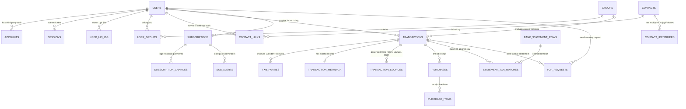

# Expent Database Schema Documentation

This document provides a highly detailed breakdown of the internal SeaORM database schema defined in `crates/db/src/entities`. It covers **why** each table exists, what its purpose is, how it connects to the **User Interface (UI)**, and the expected **API Operations (Create, Read, Update, Delete)** that interact with these tables.

---

## 1. Entity Relationship (ER) Diagram

---

## 2. Enums Reference

Before diving into the tables, here are all the shared enums used across multiple entities. These are stored as `String(20)` in the database and serialized as `SCREAMING_SNAKE_CASE` in JSON.

| Enum Name              | Values                                                      | Used By                          |
| ---------------------- | ----------------------------------------------------------- | -------------------------------- |
| `TransactionDirection` | `IN`, `OUT`                                                 | `transactions.direction`         |
| `TransactionSource`    | `MANUAL`, `OCR`, `STATEMENT`, `P2P`                         | `transactions.source`            |
| `TransactionStatus`    | `COMPLETED`, `PENDING`, `CANCELLED`                         | `transactions.status`            |
| `IdentifierType`       | `UPI`, `PHONE`, `BANK_ACC`                                  | `contact_identifiers.type`       |
| `TxnPartyRole`         | `SENDER`, `RECEIVER`                                        | `txn_parties.role`               |
| `SubscriptionCycle`    | `WEEKLY`, `MONTHLY`, `YEARLY`                               | `subscriptions.cycle`            |
| `AlertChannel`         | `EMAIL`, `PUSH`                                             | `sub_alerts.channel`             |
| `P2PRequestStatus`     | `PENDING`, `MAPPED`, `REJECTED`, `APPROVED`, `GROUP_INVITE` | `p2p_requests.status`            |
| `GroupRole`            | `ADMIN`, `MEMBER`                                           | `user_groups.role`, `users.role` |

---

## 3. User & Authentication Core

This layer powers identification, credentials, third-party sign-ins, and user verification. It is deeply connected with `better-auth`.

---

### `users`

- **Purpose**: The central identity representation. It tracks credentials, profile details, active bans, and preferences. Contains metadata such as phone numbers and 2FA status.
- **UI Standpoint**: Displays on the "Profile" page, side navigation bar, and Settings. Powers the "User Avatar" everywhere.
- **API Operations**: `POST /auth/register`, `GET /users/me`, `PUT /users/profile`, `DELETE /users/me`.

| Column                  | Type                    | Constraints               | Description                                               |
| ----------------------- | ----------------------- | ------------------------- | --------------------------------------------------------- |
| `id`                    | `String`                | **PK**, no auto-increment | Unique user identifier (UUID/CUID)                        |
| `name`                  | `String`                | required                  | Full display name                                         |
| `email`                 | `String`                | required                  | Primary email address                                     |
| `email_verified`        | `bool`                  | required                  | Whether the email has been verified                       |
| `image`                 | `String?`               | optional                  | Avatar/profile picture URL                                |
| `phone`                 | `String?`               | optional                  | Legacy phone number field                                 |
| `is_active`             | `bool`                  | required                  | Soft-delete flag; `false` = deactivated                   |
| `created_at`            | `DateTimeWithTimeZone`  | required                  | Account creation timestamp                                |
| `updated_at`            | `DateTimeWithTimeZone`  | required                  | Last profile update timestamp                             |
| `username`              | `String?`               | optional                  | Unique handle for better-auth                             |
| `display_username`      | `String?`               | optional                  | Case-preserved display version of username                |
| `role`                  | `GroupRole?`            | optional                  | Global platform role (ADMIN / MEMBER)                     |
| `banned`                | `bool?`                 | optional                  | Whether the user is currently banned                      |
| `ban_reason`            | `String?`               | optional                  | Human-readable reason for the ban                         |
| `ban_expires`           | `DateTimeWithTimeZone?` | optional                  | When the ban expires (null = permanent)                   |
| `two_factor_enabled`    | `bool?`                 | optional                  | Whether 2FA is turned on                                  |
| `phone_number`          | `String?`               | optional                  | Verified phone for better-auth phone plugin               |
| `phone_number_verified` | `bool?`                 | optional                  | Whether phone_number is verified                          |
| `associated_contact_id` | `String?`               | FK → `contacts.id`        | Links user to their own contact record                    |
| `metadata`              | `Json?`                 | optional                  | Arbitrary key-value store (preferences, onboarding state) |

**Relations**: `has_many` → Sessions, Accounts, ContactLinks, UserGroups, Transactions, Subscriptions, P2PRequests, UpiIds. `belongs_to` → Contact (via `associated_contact_id`).

**📍 Data Context — What this table holds and where it lives in the UI:**

| Column                                   | What Data It Contains                                 | Where It Comes From (UI Source)                                                   | Where It Is Displayed / Used (UI Destination)                                                                        |
| ---------------------------------------- | ----------------------------------------------------- | --------------------------------------------------------------------------------- | -------------------------------------------------------------------------------------------------------------------- |
| `name`                                   | User's full name like "Gaurav Sharma"                 | **Sign-Up Page** → Name input field; **Settings → Profile** → editable name field | **Sidebar** avatar label, **Dashboard** greeting ("Hi, Gaurav"), **Group Members** list, **TXN Drawer** "Created By" |
| `email`                                  | Primary email like `gaurav@example.com`               | **Sign-Up Page** → Email input; **Settings → Profile**                            | **Settings → Account** display, **P2P Request** sender info sent to receiver                                         |
| `email_verified`                         | `true` / `false`                                      | Set by the backend after successful OTP/magic-link verification                   | **Settings → Account** shows a "Verified ✓" or "Verify Now" badge next to email                                      |
| `image`                                  | URL to avatar (e.g., Cloudflare R2 or Google avatar)  | **Settings → Profile** → Photo upload button; or auto-pulled from Google OAuth    | **Sidebar** avatar, **Navbar** user menu, **Group Members** list avatars                                             |
| `phone`                                  | Legacy phone field                                    | **Settings → Profile** → Phone input                                              | Not prominently displayed; kept for backward compat                                                                  |
| `is_active`                              | `true` when account is live, `false` when deactivated | Backend sets to `false` on account deletion request                               | If `false`, user is blocked from login; no UI display                                                                |
| `username` / `display_username`          | Handle like `@gaurav`                                 | **Settings → Profile** → Username input (better-auth username plugin)             | **Profile Page** URL slug, **P2P** mention display                                                                   |
| `role`                                   | `ADMIN` or `MEMBER`                                   | Assigned by platform super-admin or during onboarding                             | **Admin Panel** access gate; regular users never see this                                                            |
| `banned` / `ban_reason` / `ban_expires`  | Ban status and details                                | Set by admin via **Admin Panel → User Management**                                | Banned users see a "Your account is suspended" error page                                                            |
| `two_factor_enabled`                     | Whether 2FA is active                                 | **Settings → Security** → "Enable 2FA" toggle                                     | **Settings → Security** shows 2FA status badge; login flow adds OTP step                                             |
| `phone_number` / `phone_number_verified` | Verified phone for auth                               | **Settings → Security** → Phone verification flow                                 | **Settings → Security** phone badge; used for SMS OTP login                                                          |
| `associated_contact_id`                  | Links user to their own `contacts` record             | Auto-set when user's contact record is created on first P2P interaction           | Used internally to resolve the user as a contact in `txn_parties`                                                    |
| `metadata`                               | JSON blob for preferences, onboarding flags, theme    | **Settings → Preferences**; onboarding wizard completion flags                    | Theme selection, feature flags, first-run tours                                                                      |

---

### `accounts`

- **Purpose**: Maps third-party OAuth providers (e.g., Google, Apple) or multiple credential sets to a single user context.
- **UI Standpoint**: Managed in the "Linked Accounts" or "Security" settings panel where users can connect or disconnect social accounts.
- **API Operations**: `POST /auth/link_oauth`, `DELETE /auth/unlink_oauth`.

| Column                     | Type                    | Constraints               | Description                                  |
| -------------------------- | ----------------------- | ------------------------- | -------------------------------------------- |
| `id`                       | `String`                | **PK**, no auto-increment | Internal account record ID                   |
| `account_id`               | `String`                | required                  | The provider's native user ID                |
| `provider_id`              | `String`                | required                  | Provider name (e.g., `google`, `credential`) |
| `user_id`                  | `String`                | FK → `users.id`           | Owner of this account link                   |
| `access_token`             | `String?`               | optional                  | OAuth access token                           |
| `refresh_token`            | `String?`               | optional                  | OAuth refresh token                          |
| `id_token`                 | `String?`               | optional                  | OIDC ID token                                |
| `access_token_expires_at`  | `DateTimeWithTimeZone?` | optional                  | Access token expiry                          |
| `refresh_token_expires_at` | `DateTimeWithTimeZone?` | optional                  | Refresh token expiry                         |
| `scope`                    | `String?`               | optional                  | Granted OAuth scopes                         |
| `password`                 | `String?`               | optional                  | Hashed password (for `credential` provider)  |
| `created_at`               | `DateTimeWithTimeZone`  | required                  | When this link was created                   |
| `updated_at`               | `DateTimeWithTimeZone`  | required                  | Last update timestamp                        |

**Relations**: `belongs_to` → User.

**📍 Data Context — What this table holds and where it lives in the UI:**

| Column                                        | What Data It Contains                       | Where It Comes From (UI Source)                                            | Where It Is Displayed / Used (UI Destination)                                          |
| --------------------------------------------- | ------------------------------------------- | -------------------------------------------------------------------------- | -------------------------------------------------------------------------------------- |
| `provider_id`                                 | `"google"`, `"credential"`, `"apple"`       | Determined by which OAuth button the user clicks on **Login/Sign-Up Page** | **Settings → Linked Accounts** shows provider icons (Google logo, Apple logo)          |
| `account_id`                                  | Provider's user ID (e.g., Google sub claim) | Returned by OAuth callback; never user-entered                             | Not displayed to user; used internally for deduplication                               |
| `access_token` / `refresh_token` / `id_token` | OAuth tokens for API access                 | Received from OAuth provider during login flow                             | Never shown to user; used server-side for refreshing sessions or fetching profile data |
| `password`                                    | Bcrypt/Argon2 hash of password              | **Sign-Up Page** → Password field (only for `credential` provider)         | Never displayed; validated during **Login Page** password submission                   |
| `scope`                                       | OAuth scopes like `"email profile"`         | Set by OAuth config; not user-editable                                     | Not shown; determines what data we can fetch from provider                             |

---

### `sessions`

- **Purpose**: Tracks active login tokens, their expiration limits, IP addresses, and User-Agents for robust security.
- **UI Standpoint**: Powers the "Active Sessions" settings view where users can forcefully "Log out of all devices".
- **API Operations**: `POST /auth/login` (Create), `GET /auth/sessions` (Read), `DELETE /auth/logout` (Delete token).

| Column       | Type                   | Constraints               | Description                             |
| ------------ | ---------------------- | ------------------------- | --------------------------------------- |
| `id`         | `String`               | **PK**, no auto-increment | Session record ID                       |
| `expires_at` | `DateTimeWithTimeZone` | required                  | When this session becomes invalid       |
| `token`      | `String`               | **unique**, required      | The opaque session token (cookie value) |
| `created_at` | `DateTimeWithTimeZone` | required                  | Session creation time                   |
| `updated_at` | `DateTimeWithTimeZone` | required                  | Last activity/refresh time              |
| `ip_address` | `String?`              | optional                  | Client IP at login                      |
| `user_agent` | `String?`              | optional                  | Browser/device User-Agent string        |
| `user_id`    | `String`               | FK → `users.id`           | Owning user                             |

**Relations**: `belongs_to` → User.

**📍 Data Context — What this table holds and where it lives in the UI:**

| Column       | What Data It Contains                            | Where It Comes From (UI Source)                               | Where It Is Displayed / Used (UI Destination)                         |
| ------------ | ------------------------------------------------ | ------------------------------------------------------------- | --------------------------------------------------------------------- |
| `token`      | Opaque session string like `eyJhbG...`           | Generated server-side on successful login from **Login Page** | Stored as an HTTP-only cookie; never visible to the user directly     |
| `expires_at` | Session expiry timestamp                         | Set by server config (e.g., 30 days from login)               | **Settings → Active Sessions** shows "Expires in 28 days"             |
| `ip_address` | Client IP like `103.25.40.12`                    | Captured automatically by the server on login                 | **Settings → Active Sessions** shows "IP: 103.25.x.x" per session row |
| `user_agent` | Browser string like `Mozilla/5.0 (Macintosh...)` | Captured automatically from request headers                   | **Settings → Active Sessions** shows "Chrome on macOS" (parsed)       |

---

### `verifications`

- **Purpose**: A generic secure table for OTPs, Email Magic Links, or temporary verification tokens.
- **UI Standpoint**: Represents backend state during "Verify Email" or "Enter OTP" modal prompts.
- **API Operations**: `POST /auth/send-otp`, `POST /auth/verify-otp`.

| Column       | Type                    | Constraints               | Description                             |
| ------------ | ----------------------- | ------------------------- | --------------------------------------- |
| `id`         | `String`                | **PK**, no auto-increment | Verification record ID                  |
| `identifier` | `String`                | required                  | Target (email address, phone number)    |
| `value`      | `String`                | required                  | The OTP code or hashed magic-link token |
| `expires_at` | `DateTimeWithTimeZone`  | required                  | When this token becomes unusable        |
| `created_at` | `DateTimeWithTimeZone?` | optional                  | Creation timestamp                      |
| `updated_at` | `DateTimeWithTimeZone?` | optional                  | Last update timestamp                   |

**Relations**: None (standalone, consumed-and-deleted).

**📍 Data Context — What this table holds and where it lives in the UI:**

| Column       | What Data It Contains                                         | Where It Comes From (UI Source)                                                | Where It Is Displayed / Used (UI Destination)                                           |
| ------------ | ------------------------------------------------------------- | ------------------------------------------------------------------------------ | --------------------------------------------------------------------------------------- |
| `identifier` | The email or phone being verified, e.g., `gaurav@example.com` | From the email the user entered during **Sign-Up** or **Forgot Password** flow | Not directly shown; drives which modal appears ("Check your email" vs "Enter SMS code") |
| `value`      | The actual 6-digit OTP or hashed magic-link token             | Generated server-side and sent via email/SMS                                   | User types OTP into the **Verify OTP Modal** input field; server compares               |
| `expires_at` | Expiry like "5 minutes from creation"                         | Set by server config                                                           | If expired, the **OTP Modal** shows "Code expired, resend" error                        |

---

### `user_upi_ids`

- **Purpose**: Stores one or more UPI IDs registered directly by the user, noting which one is marked as "Primary."
- **UI Standpoint**: Displayed in the "Payment Methods" or "UPI Accounts" section of User Settings.
- **API Operations**: `POST /users/upi`, `PUT /users/upi/:id/make-primary`, `DELETE /users/upi/:id`.

| Column       | Type      | Constraints               | Description                                        |
| ------------ | --------- | ------------------------- | -------------------------------------------------- |
| `id`         | `String`  | **PK**, no auto-increment | Record ID                                          |
| `user_id`    | `String`  | FK → `users.id`           | Owning user                                        |
| `upi_id`     | `String`  | **unique**, required      | The full UPI VPA (e.g., `user@upi`)                |
| `is_primary` | `bool`    | required                  | Whether this is the default UPI for payments       |
| `label`      | `String?` | optional                  | User-given nickname (e.g., "Personal", "Business") |

**Relations**: `belongs_to` → User.

**📍 Data Context — What this table holds and where it lives in the UI:**

| Column       | What Data It Contains                  | Where It Comes From (UI Source)                                   | Where It Is Displayed / Used (UI Destination)                                              |
| ------------ | -------------------------------------- | ----------------------------------------------------------------- | ------------------------------------------------------------------------------------------ |
| `upi_id`     | Full VPA like `gaurav@okicici`         | **Settings → Payment Methods** → "Add UPI ID" input field         | **Settings → Payment Methods** list; auto-filled in **New Transaction** form as sender UPI |
| `is_primary` | `true` for the default UPI             | **Settings → Payment Methods** → "Set as Primary" button          | The primary UPI shows a ⭐ badge; used as default in P2P flows                             |
| `label`      | Nickname like "Personal" or "Business" | **Settings → Payment Methods** → optional label input when adding | Displayed as subtitle under the UPI ID in the list                                         |

---

## 4. Transactions & Ledger

This is the beating heart of Expent. It stores all financial movements, context on why the movement happened, and who was involved.

---

### `transactions`

- **Purpose**: The root financial ledger. Denotes the amount, date, direction (IN/OUT), real-time status (PENDING, COMPLETED), and whether it was sourced from a statement, manual entry, or OCR.
- **UI Standpoint**: Heavily utilized in the "Dashboard Recent Transactions", "All Transactions" data table, "Analytics Charts", and the slider drawer "Transaction Details."
- **API Operations**:
  - `POST /transactions` (Manual Create)
  - `GET /transactions` (Fetch paginated/filtered list)
  - `PUT /transactions/:id` (Edit an amount/tag)
  - `DELETE /transactions/:id` (Remove a mis-logged transaction)

| Column        | Type                   | Constraints               | Description                                             |
| ------------- | ---------------------- | ------------------------- | ------------------------------------------------------- |
| `id`          | `String`               | **PK**, no auto-increment | Transaction UUID                                        |
| `user_id`     | `String`               | FK → `users.id`           | The user who owns this transaction                      |
| `amount`      | `Decimal`              | required                  | Monetary value (precision-safe)                         |
| `direction`   | `TransactionDirection` | required                  | `IN` (income/received) or `OUT` (expense/sent)          |
| `date`        | `DateTimeWithTimeZone` | required                  | When the transaction occurred                           |
| `source`      | `TransactionSource`    | required                  | How it was created: `MANUAL`, `OCR`, `STATEMENT`, `P2P` |
| `status`      | `TransactionStatus`    | required                  | Current state: `COMPLETED`, `PENDING`, `CANCELLED`      |
| `purpose_tag` | `String?`              | optional                  | Free-text category tag (e.g., "Food", "Travel")         |
| `group_id`    | `String?`              | FK → `groups.id`          | If part of a group expense                              |

**Relations**: `belongs_to` → User, Group. `has_one` → TransactionMetadata. `has_many` → TransactionSources, TxnParties, Purchases, StatementTxnMatches, SubscriptionCharges, P2PRequests.

**📍 Data Context — What this table holds and where it lives in the UI:**

| Column        | What Data It Contains                  | Where It Comes From (UI Source)                                                                                 | Where It Is Displayed / Used (UI Destination)                                                                                  |
| ------------- | -------------------------------------- | --------------------------------------------------------------------------------------------------------------- | ------------------------------------------------------------------------------------------------------------------------------ |
| `amount`      | Monetary value like `₹1,250.00`        | **Add Transaction Modal** → Amount input field; or parsed from OCR/statement                                    | **Dashboard** → "Recent Transactions" table amount column; **Transaction Drawer** header; **Analytics** chart data points      |
| `direction`   | `IN` (received) or `OUT` (spent)       | **Add Transaction Modal** → Direction toggle (Income / Expense); inferred from OCR debit/credit                 | **Dashboard** → green ↑ or red ↓ arrow icon next to amount; **Analytics** income vs expense breakdown                          |
| `date`        | When the transaction happened          | **Add Transaction Modal** → Date picker; parsed from statement/receipt                                          | **Dashboard** → date column in recent transactions; **Transaction Drawer** → date display; **Analytics** → timeline axis       |
| `source`      | `MANUAL`, `OCR`, `STATEMENT`, `P2P`    | Automatically set based on how the txn was created — manual form sets `MANUAL`, receipt upload sets `OCR`, etc. | **Transaction Drawer** → "Source" badge (e.g., "📷 OCR" or "✏️ Manual"); used for filtering in **All Transactions**            |
| `status`      | `COMPLETED`, `PENDING`, `CANCELLED`    | Defaults to `COMPLETED` for manual; `PENDING` for P2P requests awaiting approval                                | **Transaction List** → status pill badge (green/yellow/red); **P2P** flow uses `PENDING` → `COMPLETED` transition              |
| `purpose_tag` | Category like "Food", "Travel", "Rent" | **Add Transaction Modal** → Tag/Category dropdown or free-text input                                            | **Dashboard** → category badge on each row; **Analytics** → pie chart category breakdown; **All Transactions** → filter-by-tag |
| `group_id`    | Links to a group for shared expenses   | **Add Transaction Modal** → "Add to Group" dropdown (only shown if user is in groups)                           | **Group Dashboard** → transactions list; **Transaction Drawer** → "Group: Goa Trip" link                                       |

---

### `txn_parties`

- **Purpose**: Maps the people involved in the transaction (Role: SENDER vs RECEIVER). Handles links back to internal `users` or external `contacts`.
- **UI Standpoint**: Shown under the "Paid To" or "Received From" field in the transaction details drawer.
- **API Operations**: Updated automatically during Transaction `POST/PUT` actions.

| Column           | Type           | Constraints               | Description                              |
| ---------------- | -------------- | ------------------------- | ---------------------------------------- |
| `id`             | `String`       | **PK**, no auto-increment | Party record ID                          |
| `transaction_id` | `String`       | FK → `transactions.id`    | Parent transaction                       |
| `user_id`        | `String?`      | FK → `users.id`           | If the party is a registered Expent user |
| `contact_id`     | `String?`      | FK → `contacts.id`        | If the party is an external contact      |
| `role`           | `TxnPartyRole` | required                  | `SENDER` or `RECEIVER`                   |

> [!NOTE]
> Exactly one of `user_id` or `contact_id` should be set. This polymorphic FK lets the same table track both on-platform and off-platform participants.

**Relations**: `belongs_to` → Transaction, User, Contact.

**📍 Data Context — What this table holds and where it lives in the UI:**

| Column       | What Data It Contains                                   | Where It Comes From (UI Source)                                                         | Where It Is Displayed / Used (UI Destination)                                      |
| ------------ | ------------------------------------------------------- | --------------------------------------------------------------------------------------- | ---------------------------------------------------------------------------------- |
| `user_id`    | An Expent-registered user involved in the txn           | **Add Transaction Modal** → "Paid To" user search (picks from registered users)         | **Transaction Drawer** → "Paid To: Gaurav" with clickable profile link             |
| `contact_id` | An external contact (not on Expent) involved in the txn | **Add Transaction Modal** → "Paid To" contact search (picks from address book)          | **Transaction Drawer** → "Paid To: Rahul (Contact)" with contact card              |
| `role`       | `SENDER` or `RECEIVER`                                  | Inferred from `direction` — if OUT, current user is SENDER; the other party is RECEIVER | **Transaction Drawer** → labels like "You paid → Rahul" or "Received from → Priya" |

---

### `transaction_metadata`

- **Purpose**: Holds volatile / complex identifiers safely separated from the core transaction table (like specific internal API txn IDs, app caller names).
- **UI Standpoint**: Appears in the "Advanced Details" collapsed view in a transaction popup.
- **API Operations**: Updated / Read seamlessly alongside the parent transaction query.

| Column           | Type      | Constraints                    | Description                                          |
| ---------------- | --------- | ------------------------------ | ---------------------------------------------------- |
| `transaction_id` | `String`  | **PK**, FK → `transactions.id` | 1:1 link to parent transaction                       |
| `upi_txn_id`     | `String?` | optional                       | UPI network reference ID                             |
| `app_txn_id`     | `String?` | optional                       | In-app reference number from payment app             |
| `app_name`       | `String?` | optional                       | Name of the app that processed the payment           |
| `contact_number` | `String?` | optional                       | Phone number extracted from the payment notification |

**Relations**: `belongs_to` → Transaction.

**📍 Data Context — What this table holds and where it lives in the UI:**

| Column           | What Data It Contains                  | Where It Comes From (UI Source)                                  | Where It Is Displayed / Used (UI Destination)                                  |
| ---------------- | -------------------------------------- | ---------------------------------------------------------------- | ------------------------------------------------------------------------------ |
| `upi_txn_id`     | UPI network ref like `429381726354`    | Parsed from OCR screenshot text or bank statement narration      | **Transaction Drawer → Advanced Details** → "UPI Ref: 429381726354" (copyable) |
| `app_txn_id`     | In-app ref like `T2504011234`          | Parsed from payment notification screenshot                      | **Transaction Drawer → Advanced Details** → "App Ref: T2504011234"             |
| `app_name`       | Payment app like `"PhonePe"`, `"GPay"` | Parsed from OCR or manually selected during transaction creation | **Transaction Drawer** → app icon/badge next to metadata                       |
| `contact_number` | Phone like `+919876543210`             | Extracted from payment notification text via OCR                 | **Transaction Drawer → Advanced Details** → "Contact: +91 98765 43210"         |

---

### `transaction_sources`

- **Purpose**: Indicates the origin truth of a transaction. If a transaction was created from a parsed image, the source table links the raw JSON metadata and R2 Cloud uploaded file URL here.
- **UI Standpoint**: Drives the "View Original Receipt" button or "Source: PDF" badge on the UI.
- **API Operations**: Read-heavy. Written primarily via Automated workers or Upload handlers (`POST /upload/receipt`).

| Column           | Type      | Constraints               | Description                                                  |
| ---------------- | --------- | ------------------------- | ------------------------------------------------------------ |
| `id`             | `String`  | **PK**, no auto-increment | Source record ID                                             |
| `transaction_id` | `String`  | FK → `transactions.id`    | Parent transaction                                           |
| `source_type`    | `String`  | required                  | Freeform type: `MANUAL`, `OCR_SCREENSHOT`, `ICICI_PDF`, etc. |
| `r2_file_url`    | `String?` | optional                  | Cloudflare R2 URL of the uploaded source file                |
| `raw_metadata`   | `Json?`   | optional                  | Full OCR response or parsed PDF payload                      |

**Relations**: `belongs_to` → Transaction.

**📍 Data Context — What this table holds and where it lives in the UI:**

| Column         | What Data It Contains                                           | Where It Comes From (UI Source)                                         | Where It Is Displayed / Used (UI Destination)                                           |
| -------------- | --------------------------------------------------------------- | ----------------------------------------------------------------------- | --------------------------------------------------------------------------------------- |
| `source_type`  | `"MANUAL"`, `"OCR_SCREENSHOT"`, `"ICICI_PDF"`                   | Automatically set by the upload handler or manual creation flow         | **Transaction Drawer** → "Source: 📷 OCR Screenshot" badge; **All Transactions** filter |
| `r2_file_url`  | Cloudflare R2 URL like `https://r2.expent.dev/receipts/abc.jpg` | **Upload Receipt** button → file picker → uploaded to R2 by the backend | **Transaction Drawer** → "View Original" button that opens the image/PDF in a lightbox  |
| `raw_metadata` | Full JSON payload from OCR engine or PDF parser                 | Generated server-side by the OCR/parser worker                          | Not directly shown to user; drives the auto-fill of transaction fields during import    |

---

## 5. Receipts & Itemization

These tables handle deep item-level logging when the user uploads a shopping receipt (like a Swiggy or Amazon invoice).

---

### `purchases`

- **Purpose**: Sits on top of an existing transaction to represent highly granular storefront data (Vendor Name, Total Amount, Native Order ID).
- **UI Standpoint**: Represents the visual "Receipt Breakdown" in a transaction drawer.
- **API Operations**: `POST /transactions/:id/purchase` (Link a receipt).

| Column           | Type      | Constraints               | Description                          |
| ---------------- | --------- | ------------------------- | ------------------------------------ |
| `id`             | `String`  | **PK**, no auto-increment | Purchase record ID                   |
| `transaction_id` | `String`  | FK → `transactions.id`    | Parent transaction                   |
| `vendor`         | `String`  | required                  | Merchant/store name                  |
| `total`          | `Decimal` | required                  | Total receipt amount                 |
| `order_id`       | `String?` | optional                  | Vendor's native order/invoice number |

**Relations**: `belongs_to` → Transaction. `has_many` → PurchaseItems.

**📍 Data Context — What this table holds and where it lives in the UI:**

| Column     | What Data It Contains                             | Where It Comes From (UI Source)                                                  | Where It Is Displayed / Used (UI Destination)                                                  |
| ---------- | ------------------------------------------------- | -------------------------------------------------------------------------------- | ---------------------------------------------------------------------------------------------- |
| `vendor`   | Store name like `"Swiggy"`, `"Amazon"`, `"DMart"` | Parsed from uploaded receipt via OCR; or manually typed in **Add Purchase** form | **Transaction Drawer → Receipt** section header: "Receipt from Swiggy"                         |
| `total`    | Total bill amount like `₹847.00`                  | Parsed from receipt footer or manually entered                                   | **Transaction Drawer → Receipt** section: "Total: ₹847.00" — cross-verified against txn amount |
| `order_id` | Native order number like `OD4291827364`           | Parsed from receipt header via OCR                                               | **Transaction Drawer → Receipt** → "Order #OD4291827364" (copyable for refund claims)          |

---

### `purchase_items`

- **Purpose**: The direct line-items (Quantity, SKU, Price) broken out of the purchase.
- **UI Standpoint**: Rendered as a list table like "2x Milk - ₹50.00" inside the Receipt View.
- **API Operations**: Automatically updated when a `purchase` is created or modified.

| Column        | Type      | Constraints               | Description                  |
| ------------- | --------- | ------------------------- | ---------------------------- |
| `id`          | `String`  | **PK**, no auto-increment | Item record ID               |
| `purchase_id` | `String`  | FK → `purchases.id`       | Parent purchase              |
| `name`        | `String`  | required                  | Item/product name            |
| `quantity`    | `i32`     | required                  | Number of units              |
| `price`       | `Decimal` | required                  | Unit price                   |
| `sku`         | `String?` | optional                  | Stock Keeping Unit / barcode |

**Relations**: `belongs_to` → Purchase.

**📍 Data Context — What this table holds and where it lives in the UI:**

| Column     | What Data It Contains                           | Where It Comes From (UI Source)                       | Where It Is Displayed / Used (UI Destination)                                    |
| ---------- | ----------------------------------------------- | ----------------------------------------------------- | -------------------------------------------------------------------------------- |
| `name`     | Item name like `"Masala Dosa"`, `"USB-C Cable"` | Parsed from receipt line items by OCR engine          | **Transaction Drawer → Receipt → Items List** → each row shows item name         |
| `quantity` | Count like `2`                                  | Parsed from receipt or defaults to `1`                | **Receipt Items List** → "2x Masala Dosa"                                        |
| `price`    | Unit price like `₹120.00`                       | Parsed from receipt                                   | **Receipt Items List** → "₹120.00" per unit; total row = qty × price             |
| `sku`      | Barcode/SKU like `"SKU-8827364"`                | Parsed from detailed receipts (e.g., Amazon invoices) | **Receipt Items List** → shown as small grey text under item name (if available) |

---

### `purchase_imports`

- **Purpose**: Captures raw OCR engine output or unstructured text extracted from PDFs before they successfully convert to a `purchase`.
- **UI Standpoint**: Exists in a "Processing Documents" backlog view.
- **API Operations**: `POST /imports/upload`, `GET /imports/status`.

| Column        | Type      | Constraints               | Description                              |
| ------------- | --------- | ------------------------- | ---------------------------------------- |
| `id`          | `String`  | **PK**, no auto-increment | Import record ID                         |
| `pdf_url`     | `String`  | required                  | URL of the uploaded PDF in cloud storage |
| `vendor`      | `String`  | required                  | Detected or user-specified vendor        |
| `raw_content` | `String?` | optional                  | Raw extracted text from OCR/parser       |

**Relations**: None (standalone staging table).

**📍 Data Context — What this table holds and where it lives in the UI:**

| Column        | What Data It Contains                 | Where It Comes From (UI Source)                              | Where It Is Displayed / Used (UI Destination)                                                     |
| ------------- | ------------------------------------- | ------------------------------------------------------------ | ------------------------------------------------------------------------------------------------- |
| `pdf_url`     | R2 URL to the uploaded invoice PDF    | **Imports Page** → "Upload Invoice PDF" button → file picker | **Imports Page** → "View PDF" link next to each import row                                        |
| `vendor`      | Vendor name like `"Amazon"`           | Detected by OCR or manually entered by user during upload    | **Imports Page** → vendor column in the imports table                                             |
| `raw_content` | Full extracted text blob from the PDF | Generated by the OCR/parser backend worker after upload      | **Imports Page** → "View Raw Text" expandable; used as input for the parser to create `purchases` |

---

## 6. Bank Statements & Reconciliation

Expent reads bank statements and matches them securely against transactions.

---

### `bank_statement_rows`

- **Purpose**: Records individual untampered line items pulled directly from uploaded CSV/PDF bank statements.
- **UI Standpoint**: An interface comparing "Bank Record" vs "Expent Record" to ensure accounting completeness.
- **API Operations**: `POST /statements/upload`, `GET /statements`.

| Column        | Type                   | Constraints               | Description                         |
| ------------- | ---------------------- | ------------------------- | ----------------------------------- |
| `id`          | `String`               | **PK**, no auto-increment | Row record ID                       |
| `date`        | `DateTimeWithTimeZone` | required                  | Transaction date from the statement |
| `description` | `String`               | required                  | Narration/description from the bank |
| `debit`       | `Decimal?`             | optional                  | Debit amount (money out)            |
| `credit`      | `Decimal?`             | optional                  | Credit amount (money in)            |
| `balance`     | `Decimal`              | required                  | Running balance after this row      |

**Relations**: `has_many` → StatementTxnMatches.

**📍 Data Context — What this table holds and where it lives in the UI:**

| Column             | What Data It Contains                     | Where It Comes From (UI Source)           | Where It Is Displayed / Used (UI Destination)                                                  |
| ------------------ | ----------------------------------------- | ----------------------------------------- | ---------------------------------------------------------------------------------------------- |
| `date`             | Statement line date like `2026-03-15`     | Parsed from CSV/PDF bank statement upload | **Reconciliation Page** → "Bank Date" column                                                   |
| `description`      | Bank narration like `"UPI/429381/SWIGGY"` | Parsed directly from the statement        | **Reconciliation Page** → "Description" column; used for keyword matching against transactions |
| `debit` / `credit` | Money out / money in amounts              | Parsed from statement columns             | **Reconciliation Page** → amount shown with red (debit) or green (credit) coloring             |
| `balance`          | Running balance like `₹45,230.00`         | Parsed from statement balance column      | **Reconciliation Page** → "Balance" column; helps verify statement integrity                   |

---

### `statement_txn_matches`

- **Purpose**: Maps a generated `transaction` to its parsed `bank_statement_row`, storing a programmatic confidence score. Lets users verify the bot's accuracy.
- **UI Standpoint**: Appears on a "Reconciliation" or "Needs Review" panel where users Accept/Reject matches.

| Column           | Type      | Constraints                                       | Description                        |
| ---------------- | --------- | ------------------------------------------------- | ---------------------------------- |
| `row_id`         | `String`  | **PK** (composite), FK → `bank_statement_rows.id` | The statement row                  |
| `transaction_id` | `String`  | **PK** (composite), FK → `transactions.id`        | The matched transaction            |
| `confidence`     | `Decimal` | required                                          | Match confidence score (0.0 – 1.0) |

> [!TIP]
> The composite primary key `(row_id, transaction_id)` prevents duplicate matches while still allowing a single row to have multiple candidate transactions (reviewed by the user).

**Relations**: `belongs_to` → BankStatementRow, Transaction.

**📍 Data Context — What this table holds and where it lives in the UI:**

| Column           | What Data It Contains         | Where It Comes From (UI Source)                                                 | Where It Is Displayed / Used (UI Destination)                                                         |
| ---------------- | ----------------------------- | ------------------------------------------------------------------------------- | ----------------------------------------------------------------------------------------------------- |
| `row_id`         | FK to a bank statement line   | Set automatically by the reconciliation engine                                  | **Reconciliation Page** → links the left-side "Bank Row" to the right-side "Matched Transaction"      |
| `transaction_id` | FK to an Expent transaction   | Set automatically by the matching algorithm                                     | **Reconciliation Page** → the matched transaction displayed alongside the bank row                    |
| `confidence`     | Score like `0.92` (92% match) | Computed by the backend matching algorithm (date + amount + keyword similarity) | **Reconciliation Page** → "92% Match" confidence badge; low scores get a ⚠️ warning for manual review |

---

## 7. Subscriptions Management

Manages recurring expense predictions and reminders so users never miss a Spotify/Netflix cancellation date.

---

### `subscriptions`

- **Purpose**: Defines the recurring nature of a service (Cycle: Weekly/Monthly/Yearly), the exact expected amount, detection keywords ("NETFLIXCOM"), and the next charge date.
- **UI Standpoint**: The main "Subscriptions" tab widget.
- **API Operations**:
  - `POST /subscriptions`
  - `PUT /subscriptions/:id` (Change next date or status)
  - `DELETE /subscriptions/:id` (Stop tracking)

| Column               | Type                   | Constraints               | Description                                         |
| -------------------- | ---------------------- | ------------------------- | --------------------------------------------------- |
| `id`                 | `String`               | **PK**, no auto-increment | Subscription record ID                              |
| `user_id`            | `String`               | FK → `users.id`           | Owning user                                         |
| `name`               | `String`               | required                  | Service name (e.g., "Netflix", "Spotify")           |
| `amount`             | `Decimal`              | required                  | Expected recurring charge amount                    |
| `cycle`              | `SubscriptionCycle`    | required                  | `WEEKLY`, `MONTHLY`, or `YEARLY`                    |
| `start_date`         | `DateTimeWithTimeZone` | required                  | When the subscription started                       |
| `next_charge_date`   | `DateTimeWithTimeZone` | required                  | Predicted next billing date                         |
| `detection_keywords` | `String?`              | optional                  | Comma-separated keywords to auto-match transactions |

**Relations**: `belongs_to` → User. `has_many` → SubscriptionCharges, SubAlerts.

**📍 Data Context — What this table holds and where it lives in the UI:**

| Column               | What Data It Contains                      | Where It Comes From (UI Source)                                         | Where It Is Displayed / Used (UI Destination)                                                                    |
| -------------------- | ------------------------------------------ | ----------------------------------------------------------------------- | ---------------------------------------------------------------------------------------------------------------- |
| `name`               | Service name like `"Netflix"`, `"Spotify"` | **Subscriptions Page** → "Add Subscription" form → Name input           | **Subscriptions Page** → card/row title; **Dashboard** → upcoming charges widget                                 |
| `amount`             | Expected charge like `₹649.00`             | **Add Subscription** form → Amount input                                | **Subscriptions Page** → amount on each card; **Dashboard** → "₹649 due on Apr 15"                               |
| `cycle`              | `MONTHLY`, `WEEKLY`, `YEARLY`              | **Add Subscription** form → Cycle dropdown                              | **Subscriptions Page** → cycle badge ("Monthly"); drives `next_charge_date` auto-calculation                     |
| `start_date`         | When the user started the subscription     | **Add Subscription** form → Start Date picker                           | **Subscription Detail** → "Subscribed since Mar 2024"                                                            |
| `next_charge_date`   | Predicted next billing date                | Auto-calculated from `start_date` + `cycle`; can be manually overridden | **Subscriptions Page** → "Next charge: Apr 15"; **Dashboard** → upcoming charges widget; drives alert scheduling |
| `detection_keywords` | Keywords like `"NETFLIXCOM,NETFLIX"`       | **Add Subscription** form → optional Keywords input                     | Not shown to user directly; used by backend to auto-match incoming transactions to this subscription             |

---

### `subscription_charges`

- **Purpose**: Every time a transaction is mapped to a subscription, it generates a charge instance indicating the payment succeeded (or failed).
- **UI Standpoint**: The "History" accordion when clicking on a Subscription.
- **API Operations**: Read alongside `GET /subscriptions/:id`.

| Column            | Type                   | Constraints               | Description                                   |
| ----------------- | ---------------------- | ------------------------- | --------------------------------------------- |
| `id`              | `String`               | **PK**, no auto-increment | Charge record ID                              |
| `subscription_id` | `String`               | FK → `subscriptions.id`   | Parent subscription                           |
| `transaction_id`  | `String?`              | FK → `transactions.id`    | Linked transaction (null if failed/unmatched) |
| `charged_on`      | `DateTimeWithTimeZone` | required                  | Date this charge was recorded                 |
| `amount`          | `Decimal`              | required                  | Actual charged amount                         |
| `status`          | `String`               | required                  | Freeform: `CHARGED`, `FAILED`, `PENDING`      |

**Relations**: `belongs_to` → Subscription, Transaction.

**📍 Data Context — What this table holds and where it lives in the UI:**

| Column            | What Data It Contains                | Where It Comes From (UI Source)                                                             | Where It Is Displayed / Used (UI Destination)                                                             |
| ----------------- | ------------------------------------ | ------------------------------------------------------------------------------------------- | --------------------------------------------------------------------------------------------------------- |
| `subscription_id` | FK to parent subscription            | Set automatically when a charge is recorded                                                 | **Subscription Detail → History** tab → groups charges under the parent subscription                      |
| `transaction_id`  | FK to the actual payment transaction | Linked when backend matches a transaction to the subscription (via keywords or manual link) | **Subscription Detail → History** → each charge row has a "View Transaction" link                         |
| `charged_on`      | Date like `2026-03-15`               | Set when the charge is detected/recorded                                                    | **Subscription Detail → History** → date column per charge row                                            |
| `amount`          | Actual charged amount like `₹649.00` | Pulled from the linked transaction's amount                                                 | **Subscription Detail → History** → amount column; compared against expected amount for anomaly detection |
| `status`          | `CHARGED`, `FAILED`, `PENDING`       | Set by backend — `CHARGED` if matched, `PENDING` if expected but not yet detected           | **Subscription Detail → History** → status pill (green/red/yellow)                                        |

---

### `sub_alerts`

- **Purpose**: The configuration metric indicating exactly how many days _before_ the charge date that a Push/Email alert needs to fire.
- **UI Standpoint**: The "Reminder Settings" dropdown on a subscription row.
- **API Operations**: `POST /subscriptions/:id/alerts` (Setup alert), `DELETE /subscriptions/:id/alerts`.

| Column            | Type                    | Constraints               | Description                                      |
| ----------------- | ----------------------- | ------------------------- | ------------------------------------------------ |
| `id`              | `String`                | **PK**, no auto-increment | Alert record ID                                  |
| `subscription_id` | `String`                | FK → `subscriptions.id`   | Parent subscription                              |
| `days_before`     | `i32`                   | required                  | Number of days before `next_charge_date` to fire |
| `sent_at`         | `DateTimeWithTimeZone?` | optional                  | Null until the alert is actually dispatched      |
| `channel`         | `AlertChannel`          | required                  | `EMAIL` or `PUSH`                                |

**Relations**: `belongs_to` → Subscription.

**📍 Data Context — What this table holds and where it lives in the UI:**

| Column        | What Data It Contains                       | Where It Comes From (UI Source)                                            | Where It Is Displayed / Used (UI Destination)                                                 |
| ------------- | ------------------------------------------- | -------------------------------------------------------------------------- | --------------------------------------------------------------------------------------------- |
| `days_before` | Number like `3` (3 days before charge)      | **Subscription Detail → Reminders** → "Remind me \_\_\_ days before" input | **Subscription Detail → Reminders** list → "3 days before via Email"                          |
| `sent_at`     | Timestamp when the alert was actually fired | Set by server cron job when it dispatches the notification                 | **Subscription Detail → Reminders** → "Sent ✓" checkmark if already dispatched for this cycle |
| `channel`     | `EMAIL` or `PUSH`                           | **Subscription Detail → Reminders** → Channel toggle/dropdown              | **Subscription Detail → Reminders** → icon (📧 or 🔔) next to each reminder config            |

---

## 8. Contacts, Split, & P2P

Designed for users making peer-to-peer relationships, mapping local phonebooks, and splitting logic.

---

### `contacts`

- **Purpose**: A normalized address book entry for a third party a user has interacted with financially. They might not be an Expent user.
- **UI Standpoint**: Powers the searchable "Send Money" or "Paid To" target input field.
- **API Operations**: `POST /contacts`, `GET /contacts`, `PUT /contacts/:id`.

| Column      | Type      | Constraints               | Description                                           |
| ----------- | --------- | ------------------------- | ----------------------------------------------------- |
| `id`        | `String`  | **PK**, no auto-increment | Contact record ID                                     |
| `name`      | `String`  | required                  | Display name of the contact                           |
| `phone`     | `String?` | optional                  | Phone number                                          |
| `is_pinned` | `bool`    | required                  | Whether the user pinned this contact for quick access |

**Relations**: `has_many` → ContactIdentifiers.

**📍 Data Context — What this table holds and where it lives in the UI:**

| Column      | What Data It Contains                     | Where It Comes From (UI Source)                                                           | Where It Is Displayed / Used (UI Destination)                                                                  |
| ----------- | ----------------------------------------- | ----------------------------------------------------------------------------------------- | -------------------------------------------------------------------------------------------------------------- |
| `name`      | Contact display name like `"Rahul Kumar"` | **Contacts Page** → "Add Contact" form → Name input; or parsed from phone contacts import | **Contacts Page** list, **Add Transaction** → "Paid To" search results, **P2P** recipient picker               |
| `phone`     | Phone number like `+919876543210`         | **Add Contact** form → Phone input; or phone contacts import                              | **Contacts Page** → phone column; used for matching against `contact_identifiers`                              |
| `is_pinned` | `true` if user starred this contact       | **Contacts Page** → Star/Pin toggle on the contact row                                    | **Contacts Page** → pinned contacts appear at top; **Add Transaction** → pinned contacts shown first in picker |

---

### `contact_identifiers`

- **Purpose**: Binds multiple identifiers (Phone, Bank Account, UPI VPA) to a single contact. This enables matching a contact across different payment channels.
- **UI Standpoint**: Shown as chips/badges under a contact's profile card.
- **API Operations**: Managed alongside contact CRUD operations.

| Column           | Type             | Constraints               | Description                                      |
| ---------------- | ---------------- | ------------------------- | ------------------------------------------------ |
| `id`             | `String`         | **PK**, no auto-increment | Identifier record ID                             |
| `contact_id`     | `String`         | FK → `contacts.id`        | Parent contact                                   |
| `type`           | `IdentifierType` | required                  | `UPI`, `PHONE`, or `BANK_ACC`                    |
| `value`          | `String`         | required                  | The actual identifier string                     |
| `linked_user_id` | `String?`        | optional                  | If this identifier resolves to a registered user |

**Relations**: `belongs_to` → Contact.

**📍 Data Context — What this table holds and where it lives in the UI:**

| Column           | What Data It Contains                                                   | Where It Comes From (UI Source)                                                             | Where It Is Displayed / Used (UI Destination)                                                |
| ---------------- | ----------------------------------------------------------------------- | ------------------------------------------------------------------------------------------- | -------------------------------------------------------------------------------------------- |
| `type`           | `UPI`, `PHONE`, or `BANK_ACC`                                           | **Contact Detail → Add Identifier** → Type dropdown                                         | **Contact Detail** → identifier chips with icons (UPI logo, phone icon, bank icon)           |
| `value`          | The actual ID like `rahul@upi` or `9876543210`                          | **Contact Detail → Add Identifier** → Value input                                           | **Contact Detail** → displayed as chip text; used for matching in transaction flows          |
| `linked_user_id` | FK to a registered Expent user (if the contact is also on the platform) | Auto-set by backend when a match is detected (e.g., same UPI ID registered by another user) | **Contact Detail** → "On Expent ✓" badge; enables direct P2P requests instead of email-based |

---

### `contact_links`

- **Purpose**: A join table that scopes contact visibility to a specific user. Ensures User A's contacts are private from User B.
- **UI Standpoint**: Invisible to the user — it's the authorization layer behind "My Contacts".

| Column       | Type     | Constraints                            | Description                     |
| ------------ | -------- | -------------------------------------- | ------------------------------- |
| `user_id`    | `String` | **PK** (composite), FK → `users.id`    | The user who saved this contact |
| `contact_id` | `String` | **PK** (composite), FK → `contacts.id` | The contact being saved         |

**Relations**: `belongs_to` → User, Contact.

**📍 Data Context — What this table holds and where it lives in the UI:**

| Column       | What Data It Contains                                         | Where It Comes From (UI Source)                                                              | Where It Is Displayed / Used (UI Destination)                                                                           |
| ------------ | ------------------------------------------------------------- | -------------------------------------------------------------------------------------------- | ----------------------------------------------------------------------------------------------------------------------- |
| `user_id`    | The Expent user who "owns" this contact in their address book | Set automatically from the logged-in user's session when they add a contact                  | Not displayed directly; this is the invisible privacy layer — queries filter contacts by `WHERE user_id = current_user` |
| `contact_id` | The contact being bookmarked                                  | Set when user adds a contact via **Contacts Page** or when auto-created during a transaction | Not displayed directly; determines which contacts appear in the user's contact list                                     |

---

### `groups`

- **Purpose**: A collaborative space (e.g., "Goa Trip" or "Apartment Bills") for shared expense tracking.
- **UI Standpoint**: Exists inside a standalone "Groups" tab showing collaborative dashboards.
- **API Operations**: `POST /groups`, `GET /groups/:id`, `DELETE /groups/:id`.

| Column        | Type                   | Constraints               | Description                              |
| ------------- | ---------------------- | ------------------------- | ---------------------------------------- |
| `id`          | `String`               | **PK**, no auto-increment | Group record ID                          |
| `name`        | `String`               | required                  | Group display name                       |
| `description` | `String?`              | optional                  | Short description of the group's purpose |
| `created_at`  | `DateTimeWithTimeZone` | required                  | When the group was created               |

**Relations**: `has_many` → UserGroups, Transactions.

**📍 Data Context — What this table holds and where it lives in the UI:**

| Column        | What Data It Contains                            | Where It Comes From (UI Source)                          | Where It Is Displayed / Used (UI Destination)                                                              |
| ------------- | ------------------------------------------------ | -------------------------------------------------------- | ---------------------------------------------------------------------------------------------------------- |
| `name`        | Group name like `"Goa Trip 2026"`                | **Groups Page** → "Create Group" modal → Name input      | **Groups Page** → group card title; **Sidebar** → groups list; **Add Transaction** → group picker dropdown |
| `description` | Purpose like `"Split expenses for our Goa trip"` | **Create Group** modal → Description textarea (optional) | **Group Detail Page** → subtitle under the group name                                                      |
| `created_at`  | When the group was created                       | Set automatically by the server                          | **Group Detail Page** → "Created on Apr 1, 2026" footer text                                               |

---

### `user_groups`

- **Purpose**: Join table linking users to groups with role-based access (Admin can edit, Member can only view/add transactions).
- **UI Standpoint**: The "Members" list inside a group view, with role badges.
- **API Operations**: `POST /groups/:id/members`, `PUT /groups/:id/members/:uid/role`, `DELETE /groups/:id/members/:uid`.

| Column     | Type        | Constraints                          | Description         |
| ---------- | ----------- | ------------------------------------ | ------------------- |
| `user_id`  | `String`    | **PK** (composite), FK → `users.id`  | The member          |
| `group_id` | `String`    | **PK** (composite), FK → `groups.id` | The group           |
| `role`     | `GroupRole` | required                             | `ADMIN` or `MEMBER` |

**Relations**: `belongs_to` → User, Group.

**📍 Data Context — What this table holds and where it lives in the UI:**

| Column     | What Data It Contains  | Where It Comes From (UI Source)                                                                                          | Where It Is Displayed / Used (UI Destination)                                                                         |
| ---------- | ---------------------- | ------------------------------------------------------------------------------------------------------------------------ | --------------------------------------------------------------------------------------------------------------------- |
| `user_id`  | The member's user ID   | Set when a user is invited or when the creator auto-joins as admin                                                       | **Group Detail → Members** tab → member list rows                                                                     |
| `group_id` | The group being joined | Set from the group context                                                                                               | Internal FK; determines which members appear under which group                                                        |
| `role`     | `ADMIN` or `MEMBER`    | Creator auto-gets `ADMIN`; invitees join as `MEMBER`; can be changed via **Group Detail → Members → Change Role** button | **Group Detail → Members** → role badge next to each member name; `ADMIN` sees edit/delete controls, `MEMBER` doesn't |

---

### `p2p_requests`

- **Purpose**: Centralizes a request asking for money. Houses a serialized snapshot of transaction data, a targeted receiver email, and its acceptance status.
- **UI Standpoint**: Prominent in "Notifications" and under the "Pending Requests" side-nav tab. The user clicks "Mark as Paid" or "Settle."
- **API Operations**:
  - `POST /p2p/requests` (Send a request)
  - `PUT /p2p/requests/:id/approve`
  - `DELETE /p2p/requests/:id` (Cancel request)

| Column             | Type               | Constraints               | Description                                                 |
| ------------------ | ------------------ | ------------------------- | ----------------------------------------------------------- |
| `id`               | `String`           | **PK**, no auto-increment | Request record ID                                           |
| `sender_user_id`   | `String`           | FK → `users.id`           | User requesting the money                                   |
| `receiver_email`   | `String`           | required                  | Email of the person who owes money                          |
| `transaction_data` | `Json`             | required                  | JSONB snapshot of the proposed transaction details          |
| `status`           | `P2PRequestStatus` | required                  | `PENDING`, `MAPPED`, `REJECTED`, `APPROVED`, `GROUP_INVITE` |
| `linked_txn_id`    | `String?`          | FK → `transactions.id`    | Once settled, points to the actual transaction              |

> [!IMPORTANT]
> `transaction_data` stores a **snapshot** of the transaction at request time. This means even if the original data changes, the request preserves what was originally agreed upon — critical for dispute resolution.

**Relations**: `belongs_to` → User (Sender), Transaction (LinkedTransaction).

**📍 Data Context — What this table holds and where it lives in the UI:**

| Column             | What Data It Contains                                                           | Where It Comes From (UI Source)                                                                                      | Where It Is Displayed / Used (UI Destination)                                                                                                        |
| ------------------ | ------------------------------------------------------------------------------- | -------------------------------------------------------------------------------------------------------------------- | ---------------------------------------------------------------------------------------------------------------------------------------------------- |
| `sender_user_id`   | The user requesting money                                                       | Set automatically from logged-in user's session                                                                      | **Notifications Page** (receiver side) → "Gaurav requested ₹500"; **Pending Requests** (sender side) → "You requested from rahul@example.com"        |
| `receiver_email`   | Email of the person who owes money, e.g., `rahul@example.com`                   | **P2P → Send Request** form → Email input field                                                                      | **Pending Requests** list → receiver column; email used to send notification if receiver is not on Expent                                            |
| `transaction_data` | JSON snapshot like `{amount: 500, purpose: "Dinner split", date: "2026-04-01"}` | Captured from the **Send Request** form fields (amount, purpose, notes)                                              | **Notifications Page** → request detail card shows the snapshot data; **Pending Requests** → expandable detail                                       |
| `status`           | `PENDING` → `APPROVED` / `REJECTED` / `MAPPED`                                  | Starts as `PENDING` on creation; changes when receiver clicks **Approve** / **Reject** on the **Notifications Page** | **Pending Requests** → status pill; **Notifications** → action buttons change based on status (Approve/Reject for PENDING, "Settled ✓" for APPROVED) |
| `linked_txn_id`    | FK to the actual settlement transaction                                         | Set when the receiver approves and a real `transaction` is created to record the payment                             | **Pending Requests** → once settled, shows "View Transaction" link pointing to the actual ledger entry                                               |
