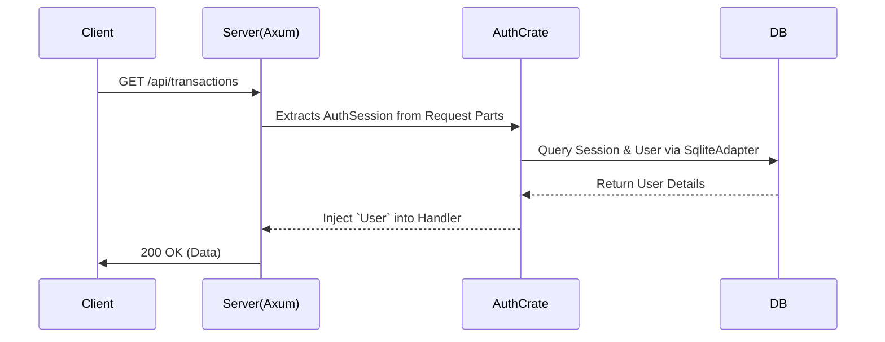

# Auth Crate Architecture Documentation

This document provides a highly detailed breakdown of the internal `auth` library crate defined at `crates/auth`. It covers **why** this crate exists, its core responsibilities, and how it interfaces with the main Axum server application.

---

## 1. Overview & Purpose

The `auth` crate serves as the bridge between the Rust backend and the TypeScript-based `better-auth` authentication suite. By isolating this logic into its own crate, the main server can easily secure endpoints without cluttering its routing logic with OAuth checks, session validation, or adapter code.

---

## 2. Core Mechanisms

The crate is broadly divided into two main components: The Database Adapter and the Axum Session Extractor.

### `adapter::SqliteAdapter`
To enable `better-auth` (which usually runs against Node.js ORMs) to access the main Rust database seamlessly, this custom wrapper was created.
- It interfaces directly with `sea-orm` and the shared `DatabaseConnection`.
- It executes CRUD operations against the schema defined in `crates/db`, specifically handling `user`, `session`, and `account` tables when `better-auth` triggers lifecycle events like login, signup, or token refresh.

### `AuthSession` Axum Extractor
In Rust's Axum framework, handler arguments act as powerful request parsers (extractors). 
- `AuthSession` implements `FromRequestParts`.
- When an API route includes `session: AuthSession` in its parameters, this crate intercepts the raw HTTP headers and calls the internal `better-auth` `/get-session` endpoint.
- If a valid session is found, it injects the verified `User` object into the handler.
- If the token is missing or expired, it automatically halts execution and returns a `401 Unauthorized` HTTP status, completely shielding the route.

---

## 3. Configuration & Initialization

### `init_auth`
This asynchronous function is invoked during the server's startup phase in `apps/server/src/main.rs`.
- It consumes environment variables like `BETTER_AUTH_SECRET`, `BASE_URL`, and `CORS_ORIGIN`.
- It registers necessary plugins such as `EmailPasswordPlugin` and `SessionManagementPlugin`.
- It compiles everything into an `Arc<BetterAuth<SqliteAdapter>>` reference, which is then safely shared across all worker threads via Axum's `State`.

