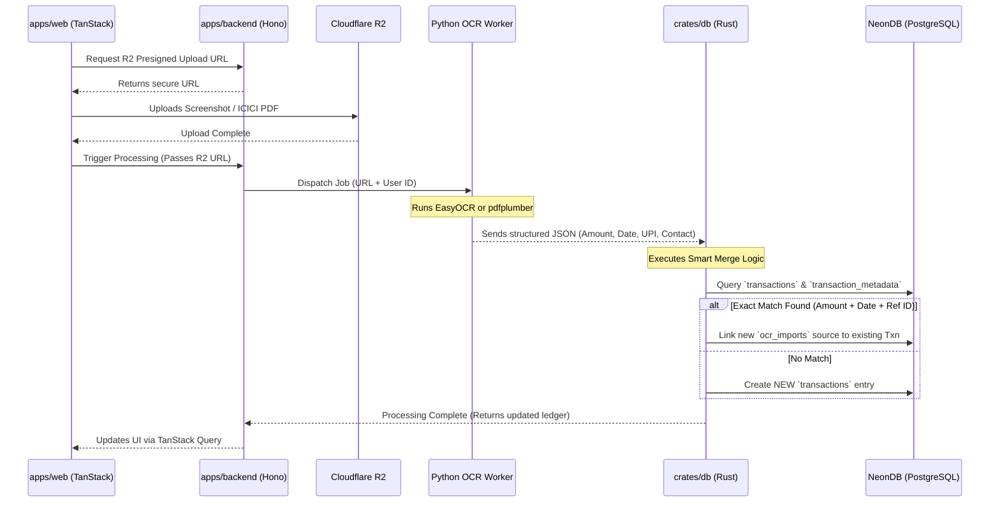
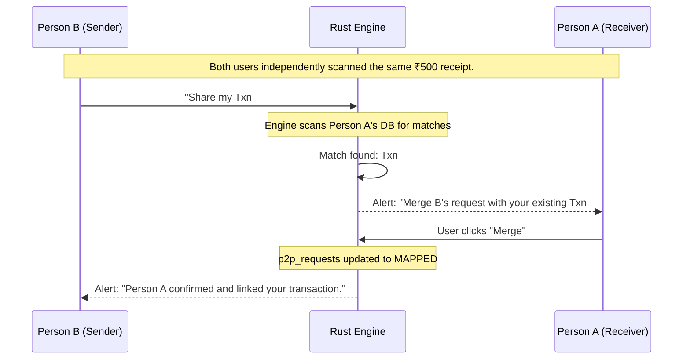

### **1. The System Architecture & Data Flow**

Here is exactly how your monorepo components will interact during the most complex flow: the **Smart Merge & Deduplication** process.

---

### **2. The Master Database Schema (SeaORM Blueprint)**

Based on your requirements for deduplication, P2P mapping, and flexible contacts, here are the exact entities you will define in `crates/db/src/entities/`.

#### **A. Identity & Authentication**

- **`users`**: Core account data. (`id` UUIDv7, `email`, `name`, `created_at`).
- **`user_auth`**: Managed by Better Auth. (`id`, `user_id`, `provider`, `token`).
- **`user_upi_ids`**: Since a user can use GPay, PhonePe, etc. (`id`, `user_id`, `upi_id`, `is_primary`, `label`).

#### **B. Contact Resolution Engine**

- **`contacts`**: The entities a user interacts with. (`id`, `user_id`, `name`, `is_pinned`).
- **`contact_identifiers`**: The deduplication engine for people. (`id`, `contact_id`, `type` [UPI, PHONE, BANK_ACC], `value`). _Example: If an OCR scan reads "9876543210", Rust checks this table to map the transaction to "John Doe"._

#### **C. The Ledger & Sources (The "Smart Merge" System)**

- **`transactions`**: The single source of truth. (`id`, `user_id`, `contact_id`, `amount`, `direction` [IN/OUT], `date`, `purpose_tag`, `status`).
- **`transaction_sources`**: The evidence. Every upload creates a row here. (`id`, `transaction_id`, `source_type` [MANUAL, OCR_SCREENSHOT, ICICI_PDF], `r2_file_url`, `raw_metadata` [JSONB]).
- **`transaction_metadata`**: App-specific IDs extracted from OCR to keep the main table clean. (`id`, `transaction_id`, `upi_txn_id`, `app_txn_id`, `payment_app` [GPay, Paytm]).

#### **D. P2P Social Syncing**

- **`p2p_requests`**: Handles the handshake between two Expent users. (`id`, `sender_user_id`, `receiver_email`, `transaction_data` [JSONB snapshot of the event], `status` [PENDING, MAPPED, REJECTED, APPROVED], `linked_txn_id` [Receiver's side]).

#### **E. Subscriptions & Itemized Receipts**

- **`subscriptions`**: (`id`, `user_id`, `contact_id`, `amount`, `cycle` [MONTHLY/YEARLY], `next_charge_date`, `detection_keywords` [TEXT[]]).
- **`purchases`**: Top-level receipt data. (`id`, `transaction_id`, `vendor`, `order_id`).
- **`purchase_items`**: Amazon-style line items. (`id`, `purchase_id`, `item_name`, `quantity`, `price`).

---

### **3. Monorepo Execution Plan**

To build this without getting tangled in integration hell, follow this exact sequence:

**Phase 1: Database & Types (The Foundation)**

1.  Initialize NeonDB.
2.  In `crates/db`, write the SeaORM migrations for the tables listed above.
3.  Implement `#[derive(TS)]` on your SeaORM models to export the exact `.d.ts` types directly into `packages/types/src/db/generated/`.

**Phase 2: Auth & Web Scaffold**

1.  Configure Better Auth in `apps/auth` (Rust) and your `apps/backend` (Hono).
2.  Wire up your login/signup pages in `apps/web/src/routes/` to establish a secure session.

**Phase 3: The Python Ingestion Pipeline**

1.  Set up your Cloudflare R2 bucket.
2.  Write the Hono endpoint in `apps/backend` to generate R2 Presigned URLs.
3.  Build the FastAPI Python worker (`apps/ocr-worker`) using EasyOCR and `pdfplumber`. It must accept an R2 URL, download the file, parse it, and return a strict JSON payload matching your `ts-rs` types.

**Phase 4: The Rust Heavy Lifting (Deduplication)**

1.  In `crates/db/src/lib.rs`, build the `SmartMerge` function. It takes the Python JSON, queries NeonDB for transactions within a 48-hour window with the exact amount, and checks for matching `transaction_metadata` (UPI IDs).
2.  If a match is found, append a new `transaction_sources` row. If not, create a new `transactions` row.

**Phase 5: The UI & P2P Engine**

1.  Build the P2P endpoints in Hono.
2.  Use TanStack Query in the frontend to fetch and display pending P2P requests and your beautiful ledger tables.

---

Let's gently refine one detail of that flow: **Only Person A (the receiver) needs the merge notification.** Here is why: Person B is actively initiating the P2P request _from_ their existing transaction. The system already knows Person B's side of the equation. It's Person A's ledger that needs the smart resolution.

### The "Smart Merge" P2P Flow

**1. The Setup**

- Person A scans a receipt -> Creates **Txn #101** (₹500).
- Person B scans a receipt -> Creates **Txn #808** (₹500).

**2. The Trigger (Person B)**

- Person B opens **Txn #808** and clicks _"Share with Person A"_.
- The frontend hits the Hono API, and the Rust engine creates a row in `p2p_requests` (Status: `PENDING`).

**3. The Smart Detection (Rust Engine)**

- Before blindly notifying Person A, the Rust backend actively queries Person A's ledger: _"Does Person A have any transaction for ₹500 within 24 hours of this date?"_
- It finds **Txn #101**.

**4. The Notification (Person A)**

- Instead of a generic "Accept/Reject" alert, Person A gets a highly contextual notification in the TanStack web app:
  > _"Person B shared a ₹500 transaction. We noticed you already logged a similar amount on this date. Do you want to link them?"_
- **Options:** `[Merge with Existing]` | `[Add as New]` | `[Reject]`

**5. The Resolution**

- Person A clicks **Merge**.
- The Rust engine updates the `p2p_requests` table:
  - `status` changes to `MAPPED`.
  - `linked_txn_id` is set to Person A's **Txn #101**.
- The two ledgers are now socially synced without a single duplicate row being created.

---

### Visualizing the Logic

This makes the UX feel incredibly intelligent. The app does the heavy lifting of finding the duplicate, but the user gets the final say.

Since we have the data ingestion, OCR deduplication, and P2P linking fully mapped out—how do you want to handle split payments in these P2P requests (e.g., the coffee was ₹500 total, but Person B is requesting exactly ₹250 from Person A)?
